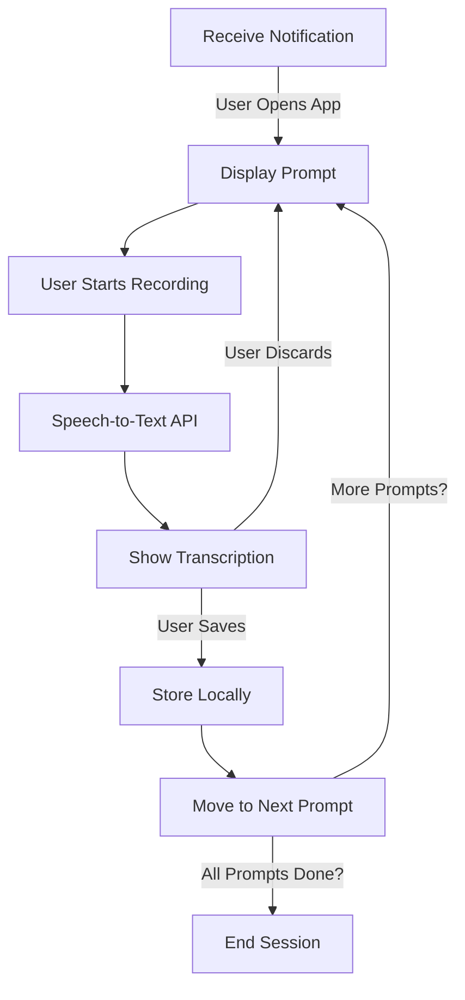

```mermaid
flowchart TD
    A[Receive Notification] -->|User Opens App| B[Display Prompt]
    B --> C[User Starts Recording]
    C --> D[Speech-to-Text API]
    D --> E[Show Transcription]
    E -->|User Saves| F[Store Locally]
    E -->|User Discards| B
    F --> G[Move to Next Prompt]
    G -->|All Prompts Done?| H[End Session]
    G -->|More Prompts?| B
``` 