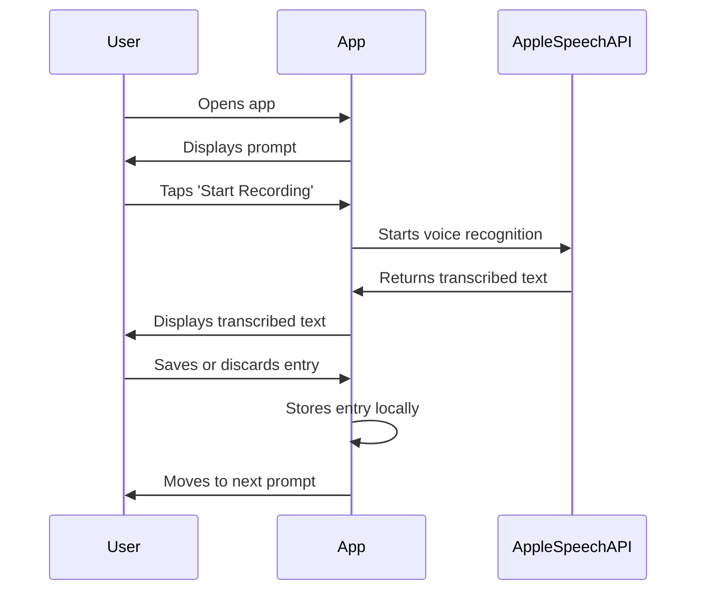

```mermaid
sequenceDiagram
    participant User
    participant App
    participant AppleSpeechAPI
    
    User->>App: Opens app
    App->>User: Displays prompt
    User->>App: Taps 'Start Recording'
    App->>AppleSpeechAPI: Starts voice recognition
    AppleSpeechAPI->>App: Returns transcribed text
    App->>User: Displays transcribed text
    User->>App: Saves or discards entry
    App->>App: Stores entry locally
    App->>User: Moves to next prompt
``` 