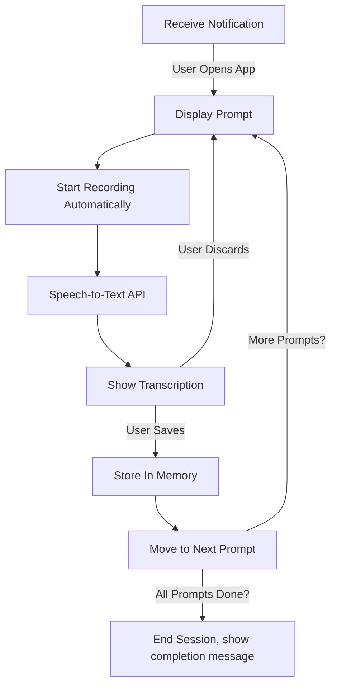

```mermaid
flowchart TD
    A[Receive Notification] -->|User Opens App| B[Display Prompt]
    B --> C[Start Recording Automatically]
    C --> D[Speech-to-Text API]
    D --> E[Show Transcription]
    E -->|User Saves| F[Store In Memory]
    E -->|User Discards| B
    F --> H[Move to Next Prompt]
    H -->|All Prompts Done?| I[End Session, show completion message]
    H -->|More Prompts?| B
``` 