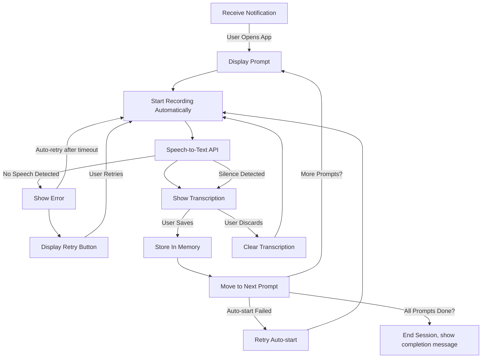

```mermaid
flowchart TD
    A[Receive Notification] -->|User Opens App| B[Display Prompt]
    B --> C[Start Recording Automatically]
    C --> D[Speech-to-Text API]
    D --> E[Show Transcription]
    D -->|No Speech Detected| F1[Show Error]
    F1 --> F2[Display Retry Button]
    F2 -->|User Retries| C
    F1 -->|Auto-retry after timeout| C
    D -->|Silence Detected| E
    E -->|User Saves| F[Store In Memory]
    E -->|User Discards| G[Clear Transcription]
    G --> C
    F --> H[Move to Next Prompt]
    H -->|Auto-start Failed| I1[Retry Auto-start]
    I1 --> C
    H -->|All Prompts Done?| I[End Session, show completion message]
    H -->|More Prompts?| B
``` 