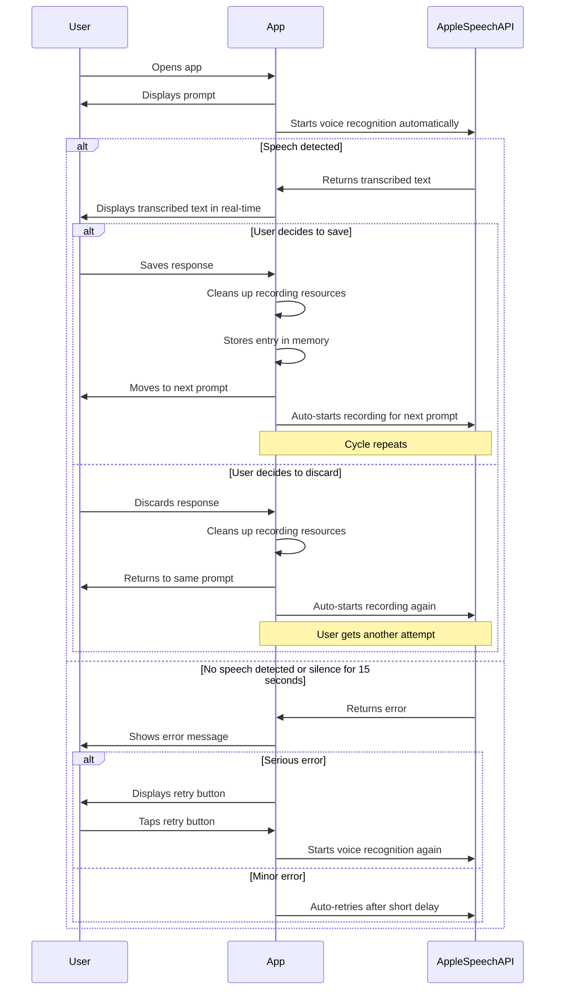

```mermaid
sequenceDiagram
    participant User
    participant App
    participant AppleSpeechAPI
    
    User->>App: Opens app
    App->>User: Displays prompt
    App->>AppleSpeechAPI: Starts voice recognition automatically
    
    alt Speech detected
        AppleSpeechAPI->>App: Returns transcribed text
        App->>User: Displays transcribed text in real-time
        
        alt User decides to save
            User->>App: Saves response
            App->>App: Cleans up recording resources
            App->>App: Stores entry in memory
            App->>User: Moves to next prompt
            App->>AppleSpeechAPI: Auto-starts recording for next prompt
            Note over App,AppleSpeechAPI: Cycle repeats
        else User decides to discard
            User->>App: Discards response
            App->>App: Cleans up recording resources
            App->>User: Returns to same prompt
            App->>AppleSpeechAPI: Auto-starts recording again
            Note over App,AppleSpeechAPI: User gets another attempt
        end
        
    else No speech detected or silence for 15 seconds
        AppleSpeechAPI->>App: Returns error
        App->>User: Shows error message
        
        alt Serious error
            App->>User: Displays retry button
            User->>App: Taps retry button
            App->>AppleSpeechAPI: Starts voice recognition again
        else Minor error
            App->>AppleSpeechAPI: Auto-retries after short delay
        end
    end
``` 