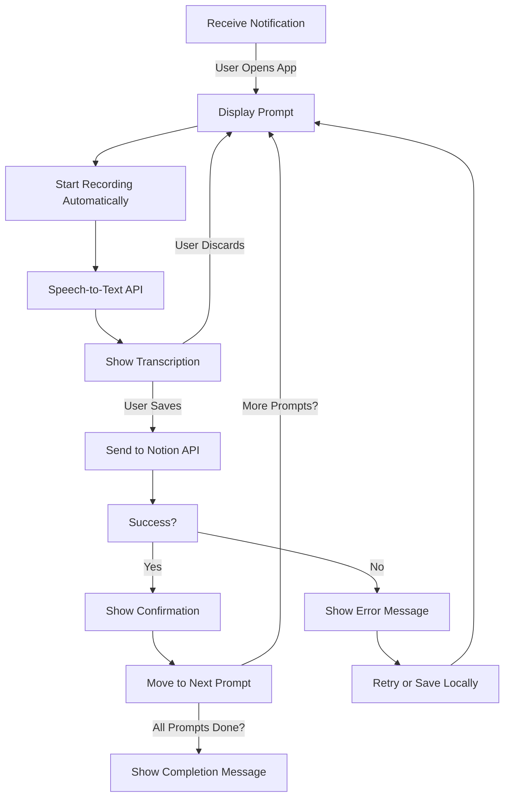

```mermaid
flowchart TD
    A[Receive Notification] -->|User Opens App| B[Display Prompt]
    B --> C[Start Recording Automatically]
    C --> D[Speech-to-Text API]
    D --> E[Show Transcription]
    E -->|User Saves| F[Send to Notion API]
    E -->|User Discards| B
    F --> H[Success?]
    H -->|Yes| I[Show Confirmation]
    H -->|No| J[Show Error Message]
    I --> K[Move to Next Prompt]
    J --> L[Retry or Save Locally]
    L --> B[Display Prompt]
    K -->|All Prompts Done?| M[Show Completion Message]
    K -->|More Prompts?| B
``` 