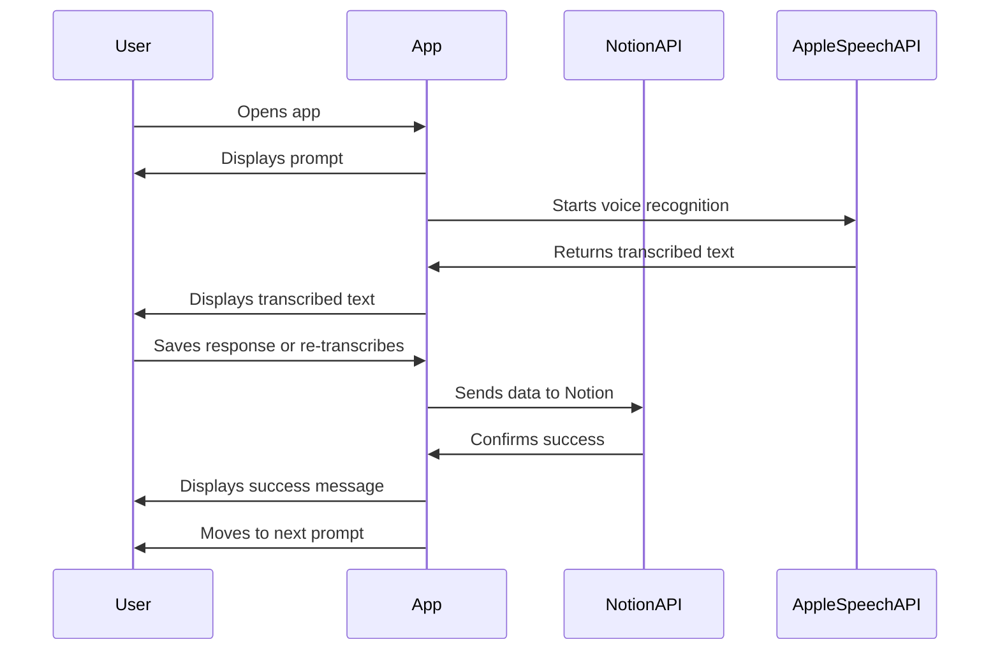

```mermaid
sequenceDiagram
    participant User
    participant App
    participant NotionAPI
    participant AppleSpeechAPI
    
    User->>App: Opens app
    App->>User: Displays prompt
    App->>AppleSpeechAPI: Starts voice recognition
    AppleSpeechAPI->>App: Returns transcribed text
    App->>User: Displays transcribed text
    User->>App: Saves response or re-transcribes
    App->>NotionAPI: Sends data to Notion
    NotionAPI->>App: Confirms success
    App->>User: Displays success message
    App->>User: Moves to next prompt
``` 