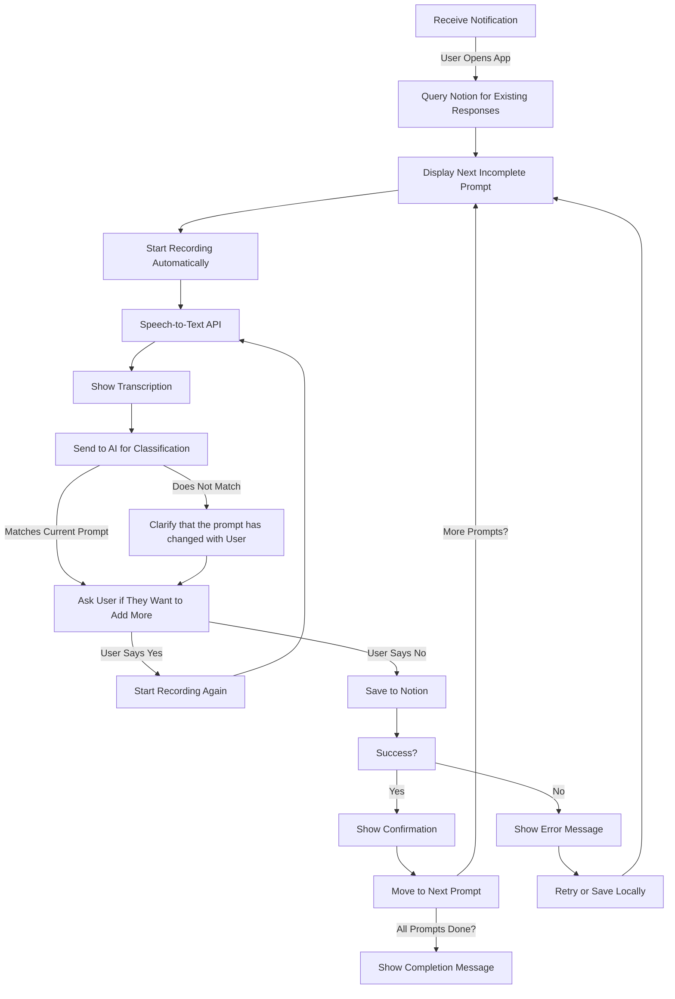

```mermaid
flowchart TD
    A[Receive Notification] -->|User Opens App| AA[Query Notion for Existing Responses]
    AA --> B[Display Next Incomplete Prompt]
    B --> C[Start Recording Automatically]
    C --> D[Speech-to-Text API]
    D --> E[Show Transcription]
    E --> F[Send to AI for Classification]
    F -->|Matches Current Prompt| G[Ask User if They Want to Add More]
    F -->|Does Not Match| H[Clarify that the prompt has changed with User]
    H --> G
    G -->|User Says Yes| I[Start Recording Again]
    G -->|User Says No| J[Save to Notion]
    I --> D
    J --> K[Success?]
    K -->|Yes| L[Show Confirmation]
    K -->|No| M[Show Error Message]
    L --> N[Move to Next Prompt]
    M --> O[Retry or Save Locally]
    O --> B
    N -->|All Prompts Done?| P[Show Completion Message]
    N -->|More Prompts?| B
``` 