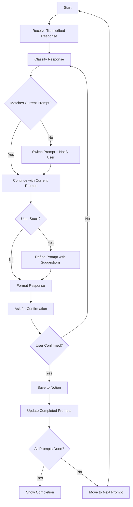

```mermaid
flowchart TD
    START[Start] --> A[Receive Transcribed Response]
    A --> B[Classify Response]
    
    %% Classification branch
    B --> C{Matches Current Prompt?}
    C -->|Yes| E[Continue with Current Prompt]
    C -->|No| D[Switch Prompt + Notify User]
    D --> E
    
    %% Refinement branch
    E --> F{User Stuck?}
    F -->|Yes| G[Refine Prompt with Suggestions]
    F -->|No| H[Format Response]
    G --> H
    
    %% Saving branch
    H --> I[Ask for Confirmation]
    I --> J{User Confirmed?}
    J -->|Yes| K[Save to Notion]
    J -->|No| B
    
    K --> L[Update Completed Prompts]
    L --> M{All Prompts Done?}
    M -->|Yes| N[Show Completion]
    M -->|No| O[Move to Next Prompt]
    O --> START
``` 