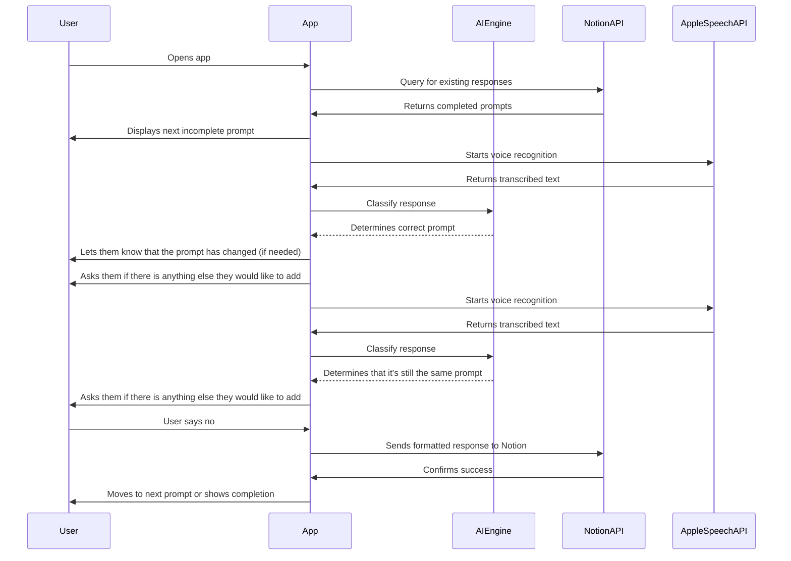

```mermaid
sequenceDiagram
    participant User
    participant App
    participant AIEngine
    participant NotionAPI
    participant AppleSpeechAPI

    User->>App: Opens app
    App->>NotionAPI: Query for existing responses
    NotionAPI->>App: Returns completed prompts
    App->>User: Displays next incomplete prompt
    App->>AppleSpeechAPI: Starts voice recognition
    AppleSpeechAPI->>App: Returns transcribed text
    App->>AIEngine: Classify response
    AIEngine-->>App: Determines correct prompt
    App->>User: Lets them know that the prompt has changed (if needed)
    App->>User: Asks them if there is anything else they would like to add
    App->>AppleSpeechAPI: Starts voice recognition
    AppleSpeechAPI->>App: Returns transcribed text
    App->>AIEngine: Classify response
    AIEngine-->>App: Determines that it's still the same prompt
    App->>User: Asks them if there is anything else they would like to add
    User->>App: User says no
    App->>NotionAPI: Sends formatted response to Notion
    NotionAPI->>App: Confirms success
    App->>User: Moves to next prompt or shows completion
``` 