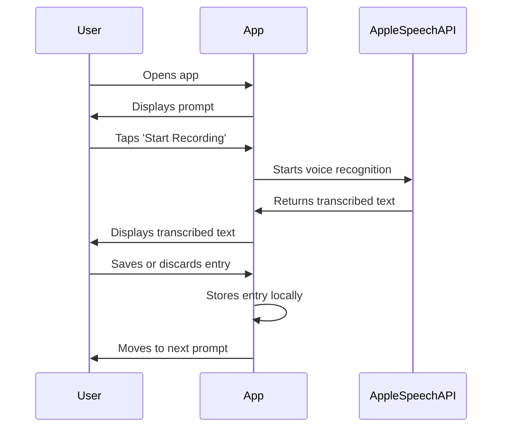
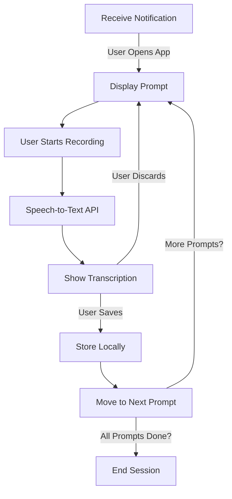

# Phase 1: Basic Local-Only Journaling App

**[Next: Phase 2](./phase_2.md)**

---

## Problem Statement
The app should remind the user to journal and allow them to record their thoughts. This phase ensures a basic but functional experience where the user receives notifications and can record their journal entries using voice input.

## Solution Overview
In this phase, we implement:
- Scheduled notifications reminding the user to journal.
- A simple UI to display prompts.
- Voice recording and transcription using Apple’s built-in speech-to-text API.
- Local storage of transcribed journal entries (not yet sent to Notion).

---

## Feature List
### **Existing (From This Phase)**
- **Notifications**: Sent at 8 AM, then every 30 minutes if the user hasn’t journaled.
- **UI**: Basic screen displaying the current prompt.
- **Speech-to-Text**: Automatic transcription when the user speaks.
- **Local Storage**: Responses saved locally (in memory or a file).
- **Journaling Flow**:
  - User opens the app and sees a prompt.
  - User taps a button to start recording.
  - Speech is transcribed and displayed on the screen.
  - User can save or discard the response.
  - App cycles through prompts in a fixed order (Desire → Gratitude → Brag).

### **New (To Be Implemented in Future Phases)**
- Auto-start recording when the app opens (Phase 2).
- Notion API integration (Phase 3).
- AI-powered prompt switching (Phase 4).
- Persistent reminders with tracking (Phase 5).

---

## Flow Diagrams

### **Mermaid Sequence Diagram**

### **Mermaid Flow Diagram**

---

## Edge Cases & Error Handling
- **User ignores notifications** → App keeps reminding every 30 minutes until 10 PM.
- **User speaks too softly** → Display an error asking them to speak louder.
- **Speech recognition fails** → Show a retry button.
- **User exits mid-session** → Journal entry is lost (to be improved in later phases).

---

## Dependencies & Configuration
- **Technologies**: Swift (iOS app), Apple Speech Framework, Local Notifications.
- **Permissions Needed**:
  - `NSMicrophoneUsageDescription` (for voice input)
  - `NSSpeechRecognitionUsageDescription` (for speech-to-text)
  - `NSUserNotificationUsageDescription` (for reminders)

---

This phase provides the foundation for the app, ensuring that users can receive reminders and record journal entries. In **Phase 2**, we will streamline the experience by automatically starting voice recording when the app opens.

**[Next: Phase 2](./phase_2.md)**