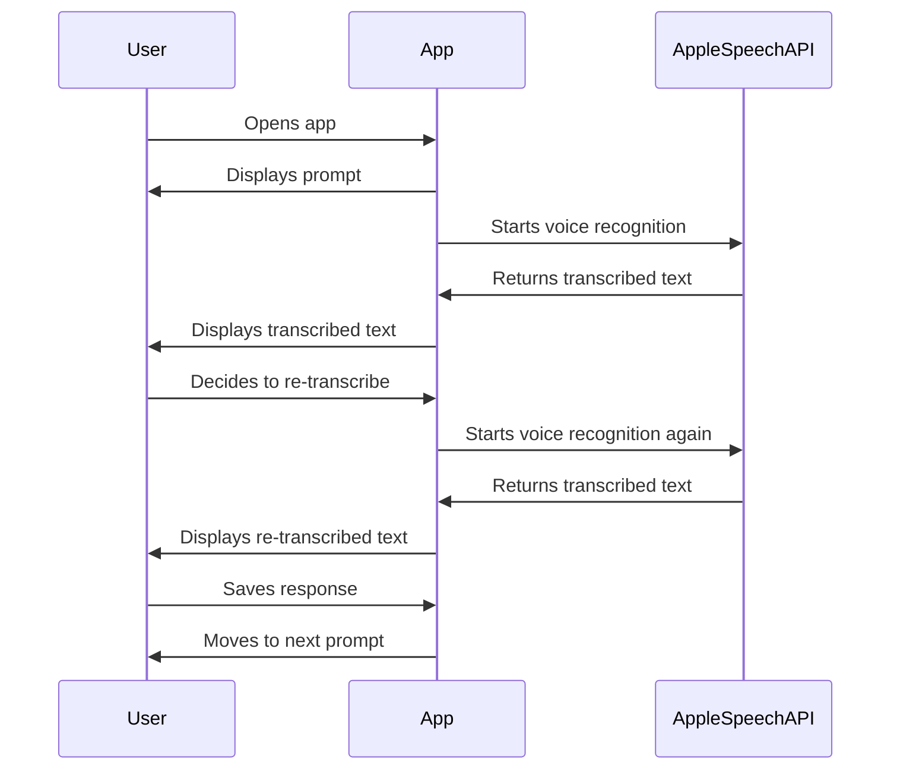
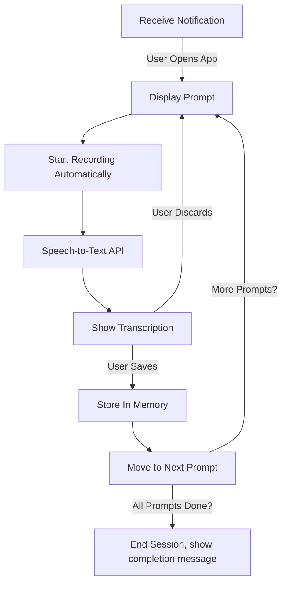

# Phase 2: Auto-Start Recording + Improved UI

**[Previous: Phase 1](./phase_1.md) | [Next: Phase 3](./phase_3.md)**

---

## Problem Statement
The journaling experience should be more seamless by automatically starting voice recording when the user opens the app. This removes unnecessary steps and makes the process faster. Additionally, the UI should dynamically update with the current prompt and display transcribed responses more intuitively.

## Solution Overview
In this phase, we implement:
- Automatic voice recording as soon as the app is opened.
- UI improvements to better display prompts and transcriptions.
- A retry option if speech recognition fails.
- The ability to edit transcribed responses before saving.

---

## Feature List
### **Existing (From Previous Phase)**
- **Notifications**: Sent at 8 AM, then every 30 minutes if the user hasn’t journaled.
- **UI**: Basic screen displaying the current prompt.
- **Speech-to-Text**: Automatic transcription when the user speaks.
- **Local Storage**: Responses saved locally in memory.
- **Journaling Flow**:
  - User opens the app and sees a prompt.
  - User starts recording manually.
  - Speech is transcribed and displayed on the screen.
  - User can save or discard the response.
  - App cycles through prompts in a fixed order (Desire → Gratitude → Brag).

### **New (Implemented in This Phase)**
- **Auto-start recording**: Voice recording begins immediately when the app is opened. If 15 seconds of silence is detected, the recording will stop automatically. Or, if the user taps a button to stop recording, the recording will stop.
- **Dynamic UI updates**:
  - Current prompt is displayed more clearly.
  - Transcriptions appear in real-time.
- **Retry speech recognition if it fails**.
- **Allow user to re-transcribe responses before saving**. Perhaps a button to re-transcribe the response and a button to save the response as is.

---

## Flow Diagrams

### **Mermaid Sequence Diagram**

### **Mermaid Flow Diagram**

---

## Edge Cases & Error Handling
- **User exits immediately after opening** → Discard any partial transcription and session (to be improved in later phases).
- **Speech recognition fails** → Show retry option.
- **App crashes mid-session** → Entry is lost (to be improved in later phases).

---

## Dependencies & Configuration
- **Technologies**: Swift (iOS app), Apple Speech Framework.
- **Permissions Needed**:
  - `NSMicrophoneUsageDescription` (for voice input)
  - `NSSpeechRecognitionUsageDescription` (for speech-to-text)
  - `NSUserNotificationUsageDescription` (for reminders)

---

This phase streamlines journaling by removing the need to manually start recording. In **Phase 3**, we will integrate Notion API support so that journal entries are stored externally.

**[Previous: Phase 1](./phase_1.md) | [Next: Phase 3](./phase_3.md)**

