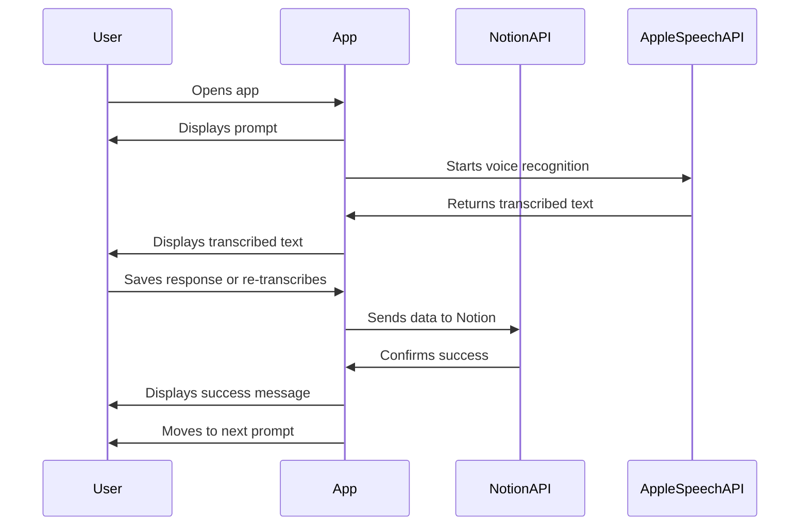
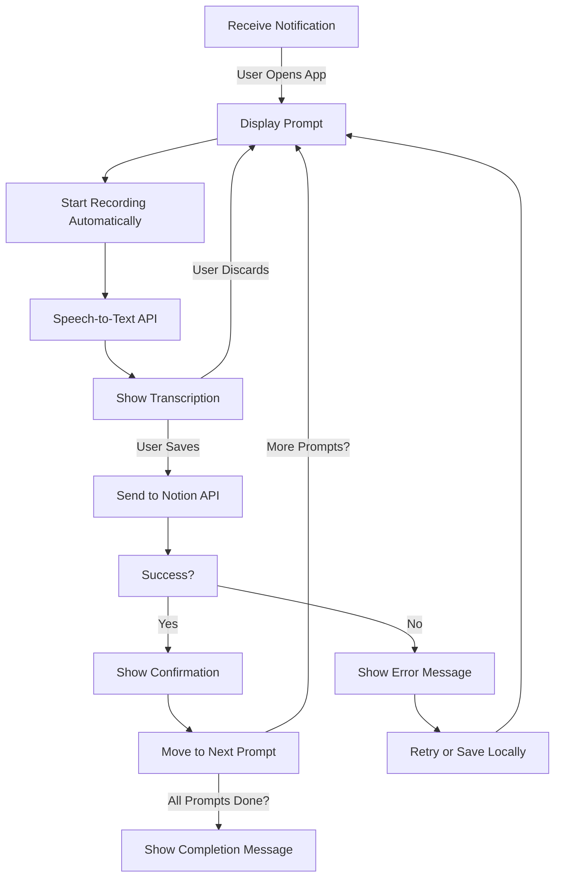

# Phase 3: Notion Integration (Basic)

**[Previous: Phase 2](./phase_2.md) | [Next: Phase 4](./phase_4.md)**

---

## Problem Statement
The app should persist journal entries beyond local storage by integrating with Notion. This allows users to access their entries outside the app while maintaining a structured format.

## Solution Overview
In this phase, we implement:
- Connection to the Notion API to store journal entries. (for now the app will connect directly to the notion page via the Notion API, but in the future we will connect to the backend and that backend will connect to Notion)
- A structured format where each prompt (Desire, Gratitude, Brag) is stored in its respective field in a Notion daily note.
- Error handling for failed API requests.
- A confirmation message after successful storage.

---

## Feature List
### **Existing (From Previous Phase)**
- **Notifications**: Sent at 8 AM, then every 30 minutes if the user hasn’t journaled.
- **UI**: Displays current prompt and transcribed response.
- **Speech-to-Text**: Automatic transcription when the app is opened.
- **Local Storage**: Responses temporarily stored in memory.
- **Journaling Flow**:
  - User opens the app
  - The app queries Notion to see what prompts already have a response recorded and shows the next prompt (if unfinished)
  - Recording begins automatically.
  - Speech is transcribed and displayed.
  - User can save the response or re-transcribe.
  - App moves to the next prompt.
  - If all prompts are finished, the app shows a completion message.

### **New (Implemented in This Phase)**
- **Notion API Integration**:
  - Append each prompt response under the appropriate field in the daily note.
- **Success Confirmation**:
  - Display a message confirming the entry was saved to Notion.
- **Error Handling**:
  - Handle failures due to no internet or API errors.
  - Show an error message if saving to Notion fails.

---

## Flow Diagrams

### **Mermaid Sequence Diagram**


### **Mermaid Flow Diagram**


---

## API Contracts & Example Requests/Responses

Note: Confirm via notion api docs that we are able to update one property at a time and that this is how we would do it. Also get an example for how to read the daily note for today.

### **Request (Sending to Notion API)**
```json
POST /send_to_notion
{
  "date": "2025-03-01",
  "gratitude": ["I am grateful for my health."],
}
```

### **Response (Success)**
```json
{
  "status": "success",
  "message": "Entry saved to Notion"
}
```

### **Response (Failure)**
```json
{
  "status": "error",
  "message": "Failed to connect to Notion API. Please check your internet connection."
}
```

---

## Edge Cases & Error Handling
- **No internet connection** → Show an error and allow retry.
- **Notion API fails** → Display an error and allow retry.

---

## Dependencies & Configuration
- **Technologies**: Swift (iOS app), Notion API.
- **Permissions Needed**:
  - `NSMicrophoneUsageDescription` (for voice input)
  - `NSSpeechRecognitionUsageDescription` (for speech-to-text)
  - `NSUserNotificationUsageDescription` (for reminders)
  - Notion API authentication key.

---

This phase ensures that journal entries are no longer stored locally but persist in Notion. In **Phase 4**, we will implement AI-powered prompt switching and formatting using LangGraph.

**[Previous: Phase 2](./phase_2.md) | [Next: Phase 4](./phase_4.md)**