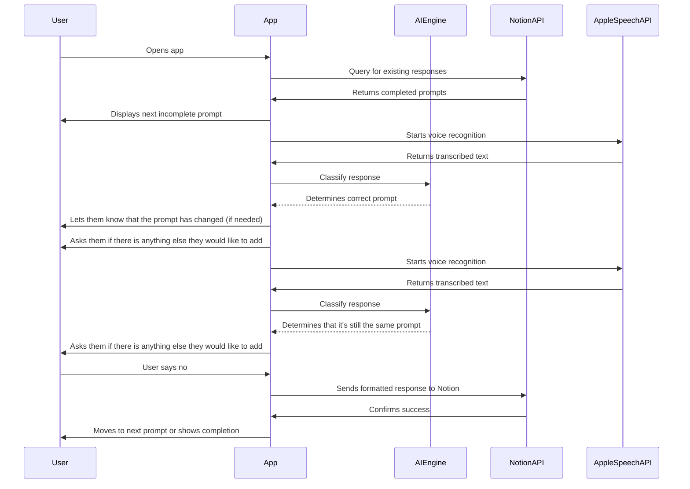
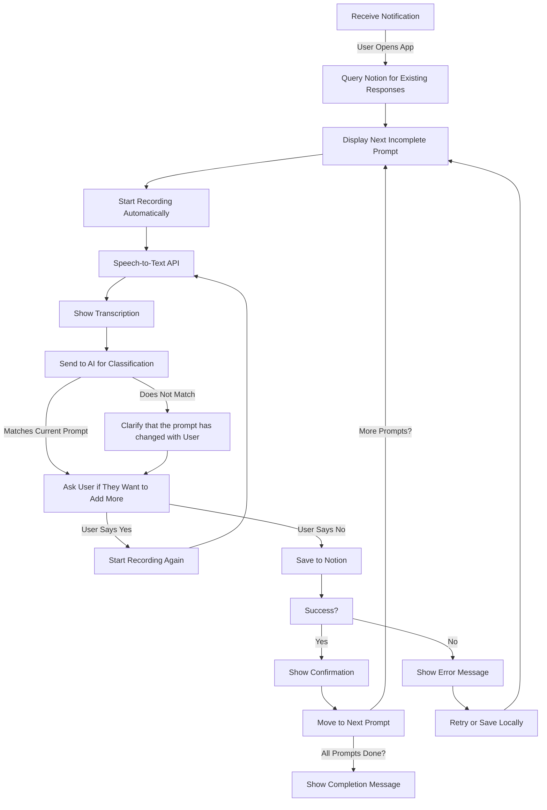

# Phase 4: AI-Powered Prompt Switching & Formatting

**[Previous: Phase 3](./phase_3.md) | [Next: Phase 5](./phase_5.md)**

---

## Problem Statement
The app should intelligently handle user responses, allowing prompt switching when a user mixes multiple types of responses. It should also refine prompts dynamically if the user gets stuck. This ensures a more natural and flexible journaling experience.

## Solution Overview
In this phase, we implement:
- AI-based classification of responses to determine whether they match the current prompt. This should use a Routing Workflow as defined in this blog: https://www.anthropic.com/research/building-effective-agents
- Dynamic prompt switching when the answer the user gives matches a different prompt.
- Adaptive prompt refinement if the user is stuck.
- Formatting of responses before sending to Notion.

Note: in this phase, we will be moving the logic that connects to the Notion API into the backend.

---
Note: consider design patterns and UI design

## Feature List
### **Existing (From Previous Phase)**
- **Notifications**: Sent at 8 AM, then every 30 minutes if the user hasn't journaled.
- **UI**: Displays current prompt and transcribed response.
- **Speech-to-Text**: Automatic transcription when the app is opened.
- **Notion API Integration**: Stores journal responses in Notion under corresponding fields.
- **Journaling Flow**:
  - User opens the app, and recording begins automatically.
  - Speech is transcribed and displayed.
  - User can edit or save the response.
  - App moves to the next prompt.

### **New (Implemented in This Phase)**
- **AI-Based Prompt Classification**:
  - Detect which of the three prompts (gratitude, desire, brag) the response best aligns with and switch to that prompt.
- **Dynamic Prompt Switching**:
  - Switch to a different prompt and let the user know that the prompt has changed.
- **Adaptive Prompt Refinement**:
  - If the user says "I don't know" or is stuck, refine the prompt with subcategories.
  - Example: If stuck on gratitude, suggest health, career, or relationships.
- **Formatting of Responses**:
  - Ensure responses are cleaned up before sending to Notion. Cleaned up means retain as much of the user's original response as possible, but remove filler words and improve readability.
- **Tracking Journaling Completion**:
  - Track which prompts have been answered for the day.
  - Consider journaling complete only when all three prompts (Desire, Gratitude, Brag) have been answered.

## UI & Styling Guidelines
- **User Feedback:**  
  - Use subtle animations (e.g., slide transitions) to indicate when the prompt changes.
  - Display an overlay message when the app auto-switches a prompt (e.g., “Switching to Gratitude”).
- **Consistent Elements:**  
  - Maintain the card-based layout and font styles from earlier phases.
  - Use progress indicators to show journaling advancement (e.g., checkmarks on completed prompts).
- **Notification of Success/Error:**  
  - Use modal popups with clear messages.
  - Success modals: green accents; error modals: red accents.
- **Color Palette:**  
  - Background: #FFFFFF (white)  
  - Primary Accent: #007AFF (iOS blue)  
  - Text: #333333 (dark gray)  
- **Typography:**  
  - Font: San Francisco (iOS default)  
  - Headings: Bold, 20pt; Body: Regular, 16pt.
- **Layout:**  
  - Clean, minimal design with plenty of white space.
  - Use rounded corners for buttons and cards.
- **Visuals:**  
  - Use simple icons (e.g., microphone icon for recording) from SF Symbols.
  - Animations for transitions (fade in/out) for a smooth user experience.
- **Layout Enhancements:**  
  - Introduce a progress indicator or subtle animation while recording.
  - Use card-style views to display prompts and transcriptions.
- **Colors & Fonts:**  
  - Maintain Phase 1 color palette.
  - Use a slightly larger font for real-time transcription display (18pt, regular).
- **Interactive Elements:**  
  - Clearly styled “Retry” and “Save” buttons with a shadow effect for depth.
  - Visual feedback (e.g., change button color) when recording starts/stops.

## Design Patterns & Architecture
- **Strategy Pattern:**  
  Implement different strategies for prompt classification (e.g., one for detecting mixed responses and another for refining prompts).
- **Chain of Responsibility:**  
  Route the response through a series of handlers (e.g., check for “I don’t know,” mixed content, or clear prompt alignment) before final formatting.
- **Mediator Pattern:**  
  Coordinate between the AI engine, the UI, and the Notion integration without tightly coupling them.
 
## Implementation Checklist
- [ ] **Integrate AI Engine:**  
  - [ ] Develop a backend endpoint that sends the transcribed text to the OpenAI API.
  
  Code Example: AI Classification Request (Swift)
    ```swift
    func classifyResponse(text: String, completion: @escaping (AIClassificationResult?) -> Void) {
        let url = URL(string: "https://your-backend.com/classify_response")!
        var request = URLRequest(url: url)
        request.httpMethod = "POST"
        request.setValue("application/json", forHTTPHeaderField: "Content-Type")
        let body = ["text": text]
        request.httpBody = try? JSONSerialization.data(withJSONObject: body, options: [])
        
        URLSession.shared.dataTask(with: request) { data, response, error in
            guard let data = data,
                let result = try? JSONDecoder().decode(AIClassificationResult.self, from: data) else {
                completion(nil)
                return
            }
            completion(result)
        }.resume()
    }
    ```
  - [ ] Implement a function that returns classification details:
    ```swift
    struct AIClassificationResult: Codable {
        let prompt: String // e.g., "gratitude", "desire", or "mixed"
        let percentages: [String: Int]
        let formattedResponse: String
    }
    ```
- [ ] **Prompt Switching Logic:**  
  - [ ] Implement a handler that checks if the response contains mixed sentiments.
  - [ ] If mixed, display a message and allow the user to confirm the switch.
- [ ] **Adaptive Prompt Refinement:**  
  - [ ] When the user says “I don't know” or is stuck, provide subcategory suggestions:
    - Example: For gratitude – “Health”, “Career”, “Relationships.”
  - [ ] Update the UI to reflect these refinements.
- [ ] **Data Formatting:**  
  - [ ] Clean the response (remove filler words, improve punctuation).
  - [ ] Use a Strategy pattern to swap between different formatting methods.
- [ ] **Testing & Debugging:**  
  - [ ] Simulate various user inputs to ensure the classification and prompt switching work as expected.
  - [ ] Log AI API responses to verify accuracy.

## Flow Diagrams

### **Mermaid Sequence Diagram**


### **Mermaid Flow Diagram**


## Dependencies & Configuration
- **Technologies**: Swift (iOS app), FastAPI (backend), LangChain, OpenAI API (for classification & formatting), Notion API.
- **Permissions Needed**:
  - `NSMicrophoneUsageDescription` (for voice input)
  - `NSSpeechRecognitionUsageDescription` (for speech-to-text)
  - `NSUserNotificationUsageDescription` (for reminders)
  - Notion API authentication key.

---

This phase makes the journaling experience much more adaptive and intelligent. In **Phase 5**, we will improve the notification system to track whether journaling has been completed and adjust reminders accordingly.

**[Previous: Phase 3](./phase_3.md) | [Next: Phase 5](./phase_5.md)**