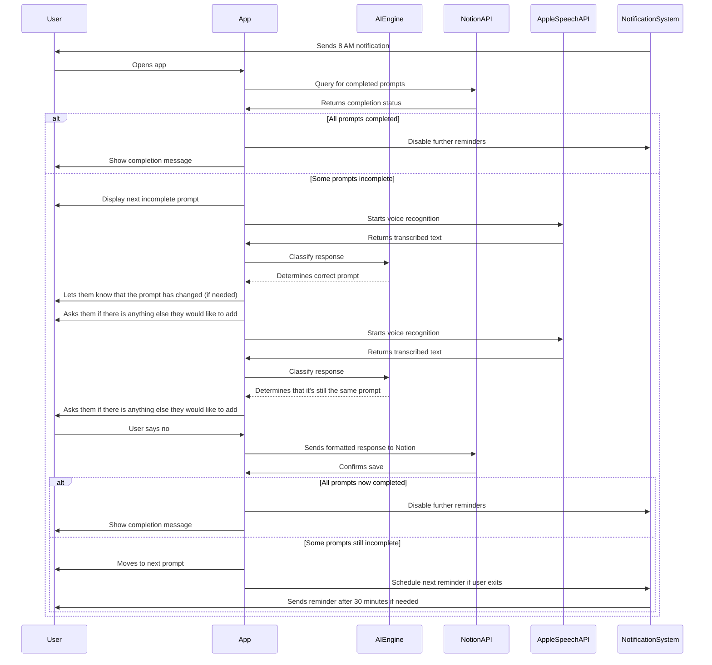
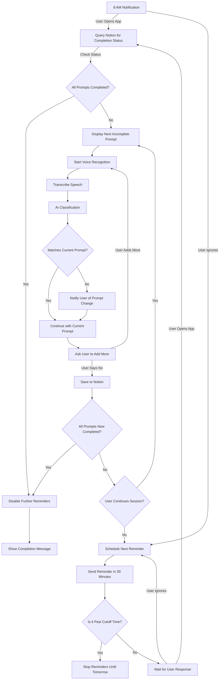

# Phase 5: Smarter Reminders & Tracking Completion

**[Previous: Phase 4](./phase_4.md) | [Next: Phase 6](./phase_6.md)**

---

## Problem Statement
The current notification system does not track whether the user has completed journaling for the day. It should intelligently adjust reminders based on whether journaling is complete, preventing unnecessary notifications while ensuring users stay on track.

## Solution Overview
In this phase, we implement:
- Smarter notifications that stop once journaling is finished.

---

## Feature List
### **Existing (From Previous Phase)**
- **AI-Based Prompt Classification**: Determines whether responses match the expected prompt and switches if needed.
- **Dynamic Prompt Switching**: Adjusts based on user input.
- **Notion API Integration**: Stores journal responses externally.
- **Speech-to-Text & UI**: Enables voice journaling with automatic transcription.
- **Tracking Journaling Completion**:
  - Track which prompts have been answered for the day.
  - Consider journaling complete only when all three prompts (Desire, Gratitude, Brag) have been answered.

### **New (Implemented in This Phase)**
- **Intelligent Notifications**:
  - Stop notifications once all prompts are completed.

---

## Flow Diagrams


### **Mermaid Sequence Diagram**


### **Mermaid Flow Diagram**


---

## API Contracts & Example Requests/Responses
### **Request (Checking Completion Status)**
```json
GET /journal_status?date=2025-03-01
```

### **Response (Incomplete Journaling)**
```json
{
  "status": "incomplete",
  "completed_prompts": ["gratitude"],
  "remaining_prompts": ["desire", "brag"]
}
```

### **Response (Completed Journaling)**
```json
{
  "status": "complete",
  "message": "User has completed all prompts for today."
}
```

### **Request (Mark Journaling as Complete Manually)**
```json
POST /complete_journaling
{
  "date": "2025-03-01"
}
```

### **Response (Success)**
```json
{
  "status": "success",
  "message": "Journaling marked as complete. No further reminders today."
}
```

---

## Edge Cases & Error Handling
- **User completes one or two prompts but exits** → The app should remind them to finish the remaining prompts.
- **User manually marks journaling as complete without answering prompts** → Allow it, but display a confirmation message.
- **App crashes mid-session** → Ensure the app resumes from the last prompt instead of restarting.
- **Notion API fails** → Store locally and retry later.

---

## Dependencies & Configuration
- **Technologies**: Swift (iOS app), FastAPI (backend), Notion API.
- **Permissions Needed**:
  - `NSUserNotificationUsageDescription` (for reminders)
  - Notion API authentication key.

---

This phase ensures the app intelligently stops and resumes reminders based on completion.

**[Previous: Phase 4](./phase_4.md)

