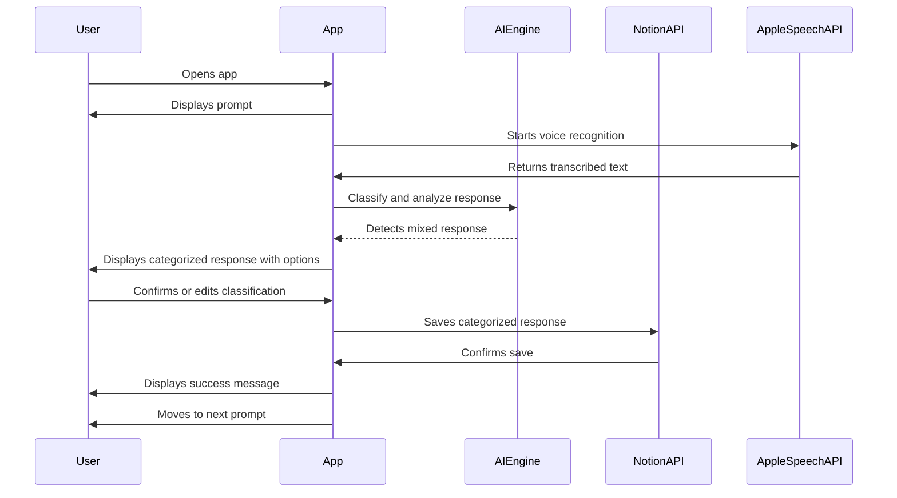
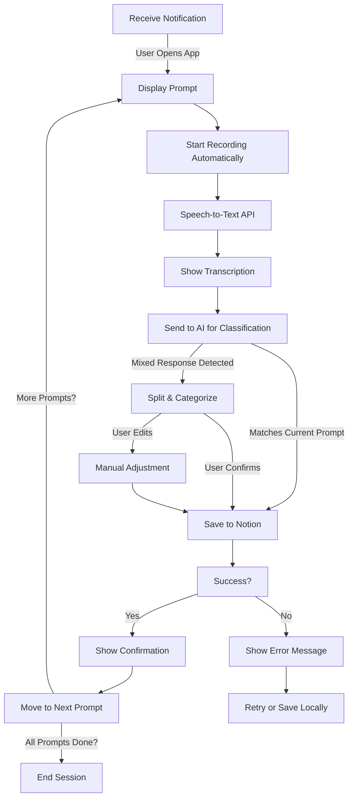

# Phase 6: Handling Mixed Responses & Seamless Prompt Switching

**[Previous: Phase 5](./phase_5.md) | [Next: Phase 7](./phase_7.md)**

---

## Problem Statement
Users may naturally mix responses within a single journal entry, making it necessary for the app to recognize and properly categorize each response. The app should flexibly process mixed entries and ensure that each portion of the response is assigned to the correct prompt.

## Solution Overview
In this phase, we implement:
- Detection of mixed responses that contain elements from multiple prompts.
- Intelligent splitting and categorization of responses.
- A prompt-switching flow that seamlessly adjusts to user input.
- The ability for users to manually correct or override AI classifications if needed.

---

## Feature List
### **Existing (From Previous Phase)**
- **Smart Notifications**: Stops reminders once all prompts are answered.
- **Tracking Completion**: Determines which prompts have been completed for the day.
- **AI-Based Prompt Classification**: Determines if a response matches the expected prompt.
- **Notion API Integration**: Saves formatted journal entries externally.
- **Speech-to-Text & UI**: Enables voice journaling with automatic transcription.

### **New (Implemented in This Phase)**
- **Mixed Response Detection**:
  - Recognize when a response includes elements of multiple prompts.
  - Identify percentages of each category in a mixed response.
- **Automatic Response Splitting**:
  - Separate and categorize different parts of the response into their respective prompts.
  - Example: “I’m grateful for my family, but I also really want a promotion.” → Split into **Gratitude** and **Desire**.
- **Seamless Prompt Switching**:
  - If a response leans heavily toward another prompt (e.g., >80% Desire in a Gratitude prompt), the app asks if the user wants to switch.
  - If a response contains at least 20% of another prompt, categorize it accordingly.
- **Manual Corrections**:
  - Users can review and override AI classifications before saving.

---

## Flow Diagrams

### **Mermaid Sequence Diagram**


### **Mermaid Flow Diagram**


---

## API Contracts & Example Requests/Responses
### **Request (Sending to AI for Classification & Splitting)**
```json
POST /classify_and_split
{
  "text": "I’m grateful for my family, but I also really want a promotion."
}
```

### **Response (AI Determines Prompt & Splits Text)**
```json
{
  "prompts": {
    "gratitude": "I’m grateful for my family.",
    "desire": "I also really want a promotion."
  },
  "percentages": {"gratitude": 60, "desire": 40}
}
```

### **Request (Saving Split Responses to Notion)**
```json
POST /send_to_notion
{
  "date": "2025-03-01",
  "gratitude": ["I’m grateful for my family."],
  "desire": ["I also really want a promotion."]
}
```

### **Response (Success)**
```json
{
  "status": "success",
  "message": "Entries saved to Notion"
}
```

---

## Edge Cases & Error Handling
- **User disagrees with AI categorization** → Provide an option to edit manually.
- **AI detects an unclear response** → Prompt user for clarification before splitting.
- **Speech-to-text produces errors** → Allow the user to edit before categorization.
- **Notion API fails** → Store locally and retry later.

---

## Dependencies & Configuration
- **Technologies**: Swift (iOS app), FastAPI (backend), OpenAI API (for classification & splitting), Notion API.
- **Permissions Needed**:
  - `NSMicrophoneUsageDescription` (for voice input)
  - `NSSpeechRecognitionUsageDescription` (for speech-to-text)
  - `NSUserNotificationUsageDescription` (for reminders)
  - Notion API authentication key.

---

This phase allows for natural, mixed journaling responses while ensuring correct classification. In **Phase 7**, we will focus on refining the UI, handling errors more gracefully, and improving overall user experience.

**[Previous: Phase 5](./phase_5.md) | [Next: Phase 7](./phase_7.md)**

