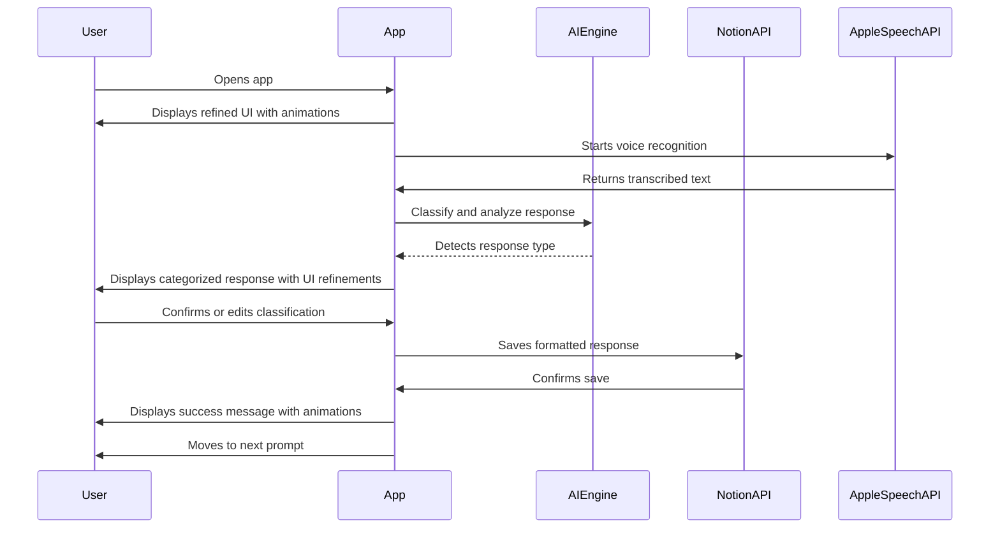
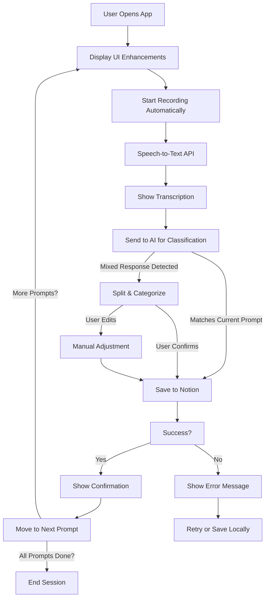

# Phase 7: UI Refinements, Error Handling & Final Improvements

**[Previous: Phase 6](./phase_6.md)**

---

## Problem Statement
Now that the core functionality of the app is implemented, the focus should shift toward refining the user experience. The UI should be intuitive and polished, errors should be handled gracefully, and the overall experience should feel smooth and reliable.

## Solution Overview
In this phase, we implement:
- UI refinements for a more polished and intuitive experience.
- Improved error handling to prevent disruptions.
- Enhancements in logging and debugging to make troubleshooting easier.
- Performance optimizations for smoother interactions.

---

## Feature List
### **Existing (From Previous Phase)**
- **Mixed Response Handling**: AI detects and categorizes mixed responses.
- **Smart Notifications**: Reminders stop when journaling is complete.
- **Tracking Completion**: Ensures all prompts are answered before stopping reminders.
- **Speech-to-Text & AI Classification**: Enables journaling with automated transcription and categorization.
- **Notion API Integration**: Saves formatted journal entries externally.

### **New (Implemented in This Phase)**
- **UI Improvements**:
  - Add animations for smoother transitions.
  - Improve text display and formatting.
  - Ensure accessibility features (larger text, voice feedback) are available.
- **Better Error Handling**:
  - Handle Notion API failures with retry mechanisms.
  - Ensure speech recognition failures do not interrupt journaling.
  - Provide clearer error messages and recovery options.
- **Logging & Debugging Enhancements**:
  - Implement structured logs for debugging API interactions.
  - Add in-app diagnostics for identifying issues.
- **Performance Optimizations**:
  - Reduce UI lag when switching prompts.
  - Optimize AI response times for faster processing.

---

## Flow Diagrams

### **Mermaid Sequence Diagram**

### **Mermaid Flow Diagram**

---

## Edge Cases & Error Handling
- **Notion API Fails** → Implement retries and fallbacks for offline storage.
- **Speech Recognition Issues** → Allow retry and ensure UI does not freeze.
- **User Exits Mid-Journaling** → Preserve progress for next session.
- **Slow AI Response** → Implement loading indicators and async processing.
- **App Crash or Unexpected Behavior** → Provide a way to report issues and recover.

---

## Dependencies & Configuration
- **Technologies**: Swift (iOS app), FastAPI (backend), OpenAI API (for classification & formatting), Notion API.
- **Permissions Needed**:
  - `NSMicrophoneUsageDescription` (for voice input)
  - `NSSpeechRecognitionUsageDescription` (for speech-to-text)
  - `NSUserNotificationUsageDescription` (for reminders)
  - Notion API authentication key.

---

This final phase ensures the app is polished and user-friendly, with strong error handling and performance improvements. The app should now be **fully functional, smooth, and ready for real-world use.** 🎉

**[Previous: Phase 6](./phase_6.md)**

